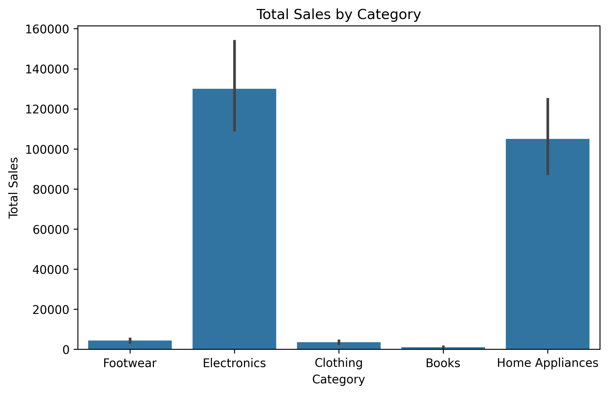
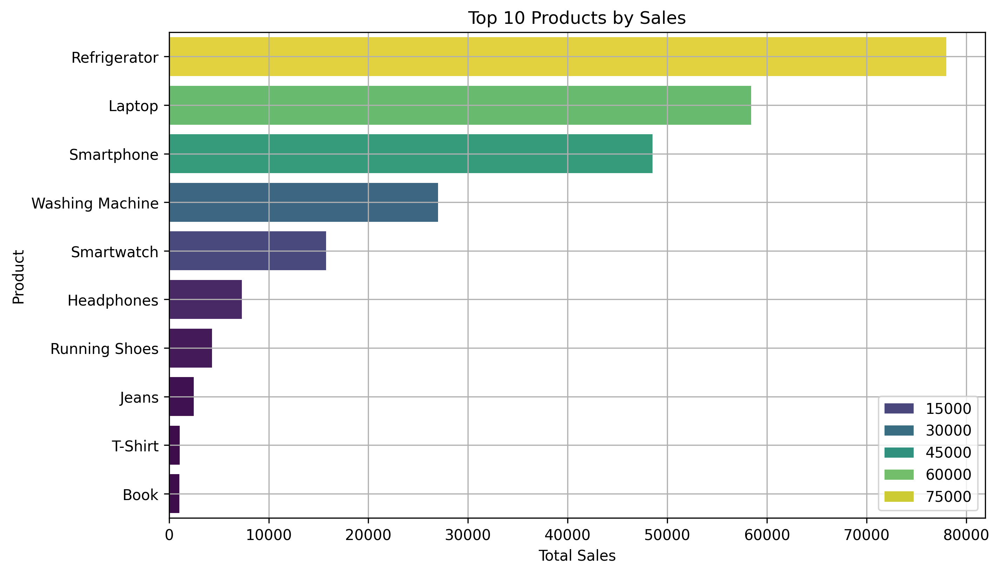
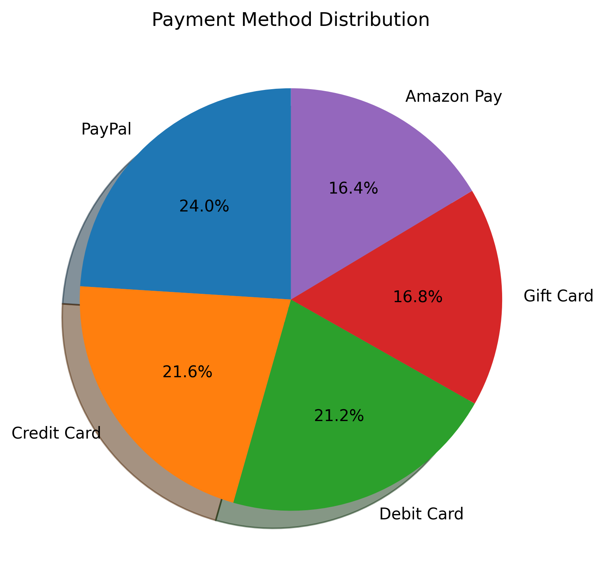
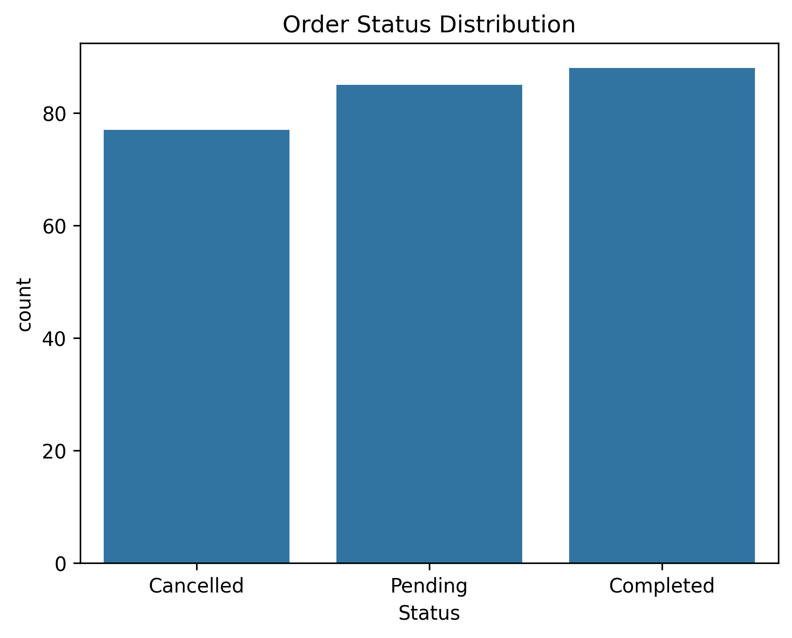

# 📊 Amazon Sales Dashboard  

## 📌 Project Overview  
This project analyzes **Amazon sales data** to uncover insights into customer behavior, product performance, and overall sales trends.  
The dataset includes order details such as **Product, Category, Price, Quantity, Customer Info, Payment Method, and Order Status**.  

I used **Python, Pandas, Matplotlib, and Seaborn** to clean, engineer, and visualize the data.  

---

## 🛠️ Tools & Libraries  
- Python 🐍  
- Pandas 📑  
- Matplotlib 📉  
- Seaborn 🎨 

---

## 📂 Dataset  
- **File**: `amazon_sales_data_2025.csv`  
- **Rows**: 250  
- **Columns**: 11  
- **Key Columns**:  
  - `Order ID`  
  - `Date`  
  - `Product`  
  - `Category`  
  - `Price`  
  - `Quantity`  
  - `Total Sales`  
  - `Customer Name`  
  - `Customer Location`  
  - `Payment Method`  
  - `Status`  

---

## 🔧 Data Preparation  
### Steps performed:  
1. **Data Cleaning**  
   - Converted `Date` to datetime format  
   - Converted `Price` & `Total Sales` to numeric  
   - Checked for missing values and duplicates  

2. **Feature Engineering**  
   - Extracted `Year`, `Month`, `DayOfWeek` from `Date`  
   - Validated `Total Sales = Price × Quantity`  
   - Created customer and category level summaries  

---

## 📊 Visualizations  

### 1. Sales by Category  
Shows which product categories generate the most revenue.  
  

### 2. Top 10 Products by Sales  
Highlights the highest-performing products.  
  

### 3. Monthly Sales Trend  
Line chart showing how sales fluctuate month to month.  
  

### 4. Payment Method Distribution  
Pie chart showing customer preferences for payment methods.  
  

### 5. Order Status Distribution  
Counts of orders completed, cancelled, or pending.  
  

---

## 🚀 How to Run This Project  

1. Clone this repository:  
   ```bash
   git clone https://github.com/your-username/amazon-sales-dashboard.git
   ```  

2. Navigate to the project folder:  
   ```bash
   cd amazon-sales-dashboard
   ```  

3. Install required libraries:  
   ```bash
   pip install -r requirements.txt
   ```  

4. Open the Jupyter Notebook:  
   ```bash
   jupyter notebook notebooks/amazon_sales_dashboard.ipynb
   ```  

5. Run all cells to generate the dashboard.  

---

## 📌 Key Insights  
- 📈 **Footwear** and **Electronics** categories contribute the highest sales  
- 💳 **Debit Card** is the most preferred payment method  
- ⏳ Order cancellations are relatively low compared to completed orders  
- 📅 Sales peak in certain months, showing **seasonal buying trends**  

---

## ✨ Future Improvements  
- Add interactive dashboards using **Plotly or Power BI**  
- Include customer segmentation analysis  
- Build a predictive model for future sales  

---

## 📂 Project Structure  

```
amazon-sales-dashboard/
│── README.md                     
│── requirements.txt               
│── notebooks/
│   └── amazon_sales_dashboard.ipynb   
│── data/
│   └── amazon_sales_data_2025.csv     
│── images/
│   ├── sales_by_category.png          
│   ├── top_products.png
│   ├── monthly_trend.png
│   ├── payment_methods.png
│   └── order_status.png
```

---

## 👨‍💻 Author  
**Your Name** – [GitHub Profile](https://github.com/your-username)  
